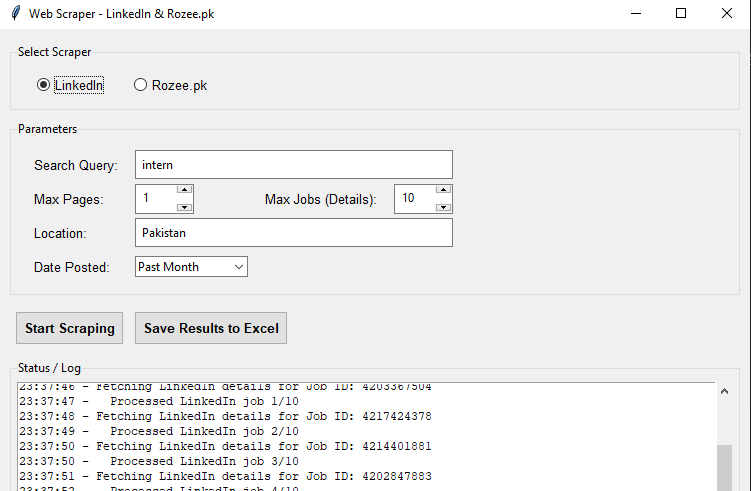

# Interni.pk Tools

This repository contains executable tools and scripts for scraping job postings from the web. It includes all the tools I use to collect internship and job listings for interni.pk.


## Executable Tool



### Installation
1. Download the latest release from the [releases page](https://github.com/yourusername/interni.pk/releases)
2. Extract the ZIP file to your desired location
3. Run `interni.exe`

### Usage
1. Open the application
2. Currently Supported Job Websites:
   - LinkedIn Jobs
   - Rozee.pk
   
   Coming Soon:
   - Glassdoor
   - Indeed

3. Enter your search criteria:
   - Search Query
   - Max pages
   - Date Posted
   - Location

4. Click "Start Scraping" to start scraping jobs from supported platforms

5. To save the results click "Save results to Excel"

Note: Make sure you have a stable internet connection while using the application.

## Scripts

The repository includes Python scripts that contain the core logic for scraping jobs from various platforms (LinkedIn, Rozee.pk).

### Setup

```bash
python -m venv venv
source venv/bin/activate  # On Windows use: venv\Scripts\activate
pip install -r src/requirements.txt
```

### Available Scripts

The scripts contain the basic implementation of web scraping logic for:
- LinkedIn Jobs Scraper
- Rozee.pk Scraper

To run any script:
```bash
python script_name.py
```

Note: These scripts contain the fundamental scraping logic that powers the executable application. They are provided for reference and development purposes.
